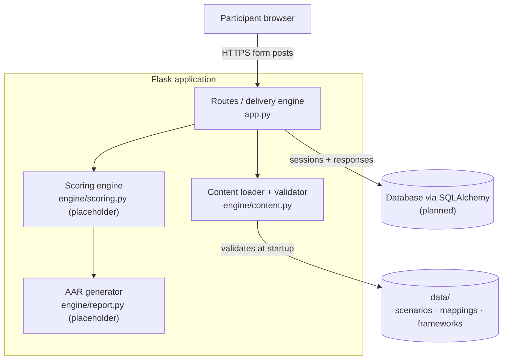

# System Architecture — AutoGSESec

Version: v0.1.0 baseline (Implementation Sprint I). Design decisions are documented in the Hard Stop 2 Design Review Package.

## Overview

AutoGSESec is a server-rendered Flask application. Scenario content and framework mappings are versioned JSON files in Git. The database (planned) holds runtime session data only.

## Components and Status

| Component | File | Responsibility | Status at v0.1.0 |
|-----------|------|----------------|------------------|
| Delivery engine | `app.py` | Routes, session state, input validation | Built |
| Content loader | `engine/content.py` | Loads JSON; refuses to start on missing or unknown mappings | Built |
| Scoring engine | `engine/scoring.py` | Rule-based scoring and readiness rating | Interface defined; Hard Stop 4 |
| AAR generator | `engine/report.py` | Gaps, controls, timelines | Interface defined; Hard Stop 4 |
| Persistence | `models.py` (planned) | Sessions and responses via SQLAlchemy | Sprint II |
| Pages and styles | `templates/`, `static/` | Pages and persistent disclaimer (FR-09) | Built |
| Tests | `tests/` | Functional and smoke tests, run by GitHub Actions | Built |

## Planned Interaction: Scoring and Report

When a participant submits decision 3, the planned `/scenario/<id>/report` route will:

1. Collect the participant's answers as `{decision_point_id: option_id}`.
2. Call `scoring.score_session(scenario, answers)`. It looks up each answer in the scenario's mapping and returns the percent score, readiness rating, and list of gaps.
3. Call `report.build_report(scenario, score_result)`. It orders gaps by timeline and attaches control names from `data/frameworks.json`.
4. Render `templates/report.html`.

Neither module reads files or the database. Both receive data the loader has already validated, so they behave as pure functions: the same input always gives the same output (NFR-06), which makes them straightforward to test.

## Data Design

### Content (versioned JSON in Git)

| File | Holds |
|------|-------|
| `data/scenarios/<id>.json` | Story, prompts, and options only (no framework IDs) |
| `data/mappings/<id>.json` | Rating, NIST controls, timeline, and rationale per option; ATT&CK tactic; framework versions |
| `data/frameworks.json` | Valid ATT&CK for ICS tactic IDs and NIST control IDs, with version tags |

Content and mappings are kept apart so they can be updated independently when MITRE ATT&CK or NIST SP 800-82 is revised.

### Runtime database (planned)

**sessions**: session_id (random UUID), scenario_id, content_version, started_at, completed_at, pre_understanding, post_understanding

**responses**: response_id, session_id, decision_point_id, option_id, submitted_at

No field identifies a person (NFR-09). Scores are not stored; the report is regenerated from responses and mappings.

## Computational Method

Deterministic, rule-based scoring. Correct = 2 points, partial = 1, incorrect = 0. Percent = earned ÷ possible × 100. Readiness: Prepared at 80% or above, Developing at 50–79%, Unprepared below 50%. Every score traces to a named NIST control. No machine learning.

## Deployment (planned)

Render free web service, auto-deployed from `main`. Free services spin down after 15 minutes idle and do not keep local files, so production data will use a free Render Postgres database during the testing window (decision recorded at Sprint II, task T4).